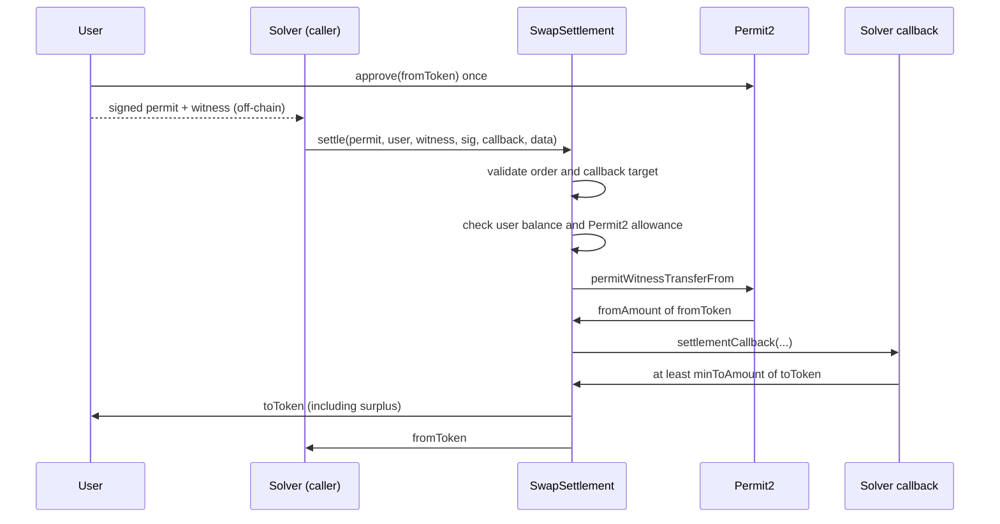

# Swap Settlement Contract

Atomic settlement of user-signed swap intents against solver-provided liquidity, using
[Uniswap Permit2](https://github.com/Uniswap/permit2) for signature verification, expiry,
and replay protection.

A user signs a Permit2 `PermitWitnessTransferFrom` that commits to both sides of the trade.
A solver submits it on-chain, sources the buy token through a callback, and gets paid in the
sell token — all in a single transaction that reverts entirely if any leg fails.

## How it works



The signed order spans two structures, both covered by one signature:

| Side | Source                       | Fields                                 |
| ---- | ---------------------------- | -------------------------------------- |
| Sell | Permit2 `PermitTransferFrom` | `token`, `amount`, `nonce`, `deadline` |
| Buy  | `SwapWitness` (witness)      | `toToken`, `minToAmount`               |

Permit2 binds `spender` to `msg.sender`, so a signature is only valid for the specific
settlement contract that submits it.

## Contracts

| File                                                                                         | Purpose                                         |
| -------------------------------------------------------------------------------------------- | ----------------------------------------------- |
| [contracts/SwapSettlement.sol](contracts/SwapSettlement.sol)                                 | Settlement entry point                          |
| [contracts/interfaces/ISettlementCallback.sol](contracts/interfaces/ISettlementCallback.sol) | Interface solvers implement to supply liquidity |
| [contracts/interfaces/ISignatureTransfer.sol](contracts/interfaces/ISignatureTransfer.sol)   | Subset of Permit2 used here                     |
| [contracts/mocks/](contracts/mocks)                                                          | Test-only ERC-20 and solver                     |

### `settle`

```solidity
function settle(
    ISignatureTransfer.PermitTransferFrom calldata permit,
    address user,
    SwapWitness calldata witness,
    bytes calldata signature,
    address callbackTarget,
    bytes calldata callbackData
) external returns (uint256 toAmount);
```

Steps, in order:

1. Validate the order fields and the callback target.
2. Check the user's `fromToken` balance and their Permit2 allowance.
3. Pull `fromAmount` from the user via `permitWitnessTransferFrom`.
4. Call `settlementCallback` on `callbackTarget`.
5. Require the contract's `toToken` balance to have grown by at least `minToAmount`.
6. Send `toToken` to the user and `fromToken` to `msg.sender`.

Any failure reverts the whole transaction. A `Settled` event records the executed amounts.

### Writing a solver

The callback runs while the settlement contract holds the sell token, but the sell token is
paid out only _after_ the callback returns. The solver therefore needs its own inventory or
a flash loan to deliver the buy token — it receives no allowance from the settlement contract.

```solidity
contract MySolver is ISettlementCallback {
    function settlementCallback(
        address fromToken,
        uint256 fromAmount,
        address toToken,
        uint256 minToAmount,
        bytes calldata data
    ) external {
        // msg.sender is the settlement contract; deliver at least minToAmount to it.
        IERC20(toToken).transfer(msg.sender, minToAmount);
    }
}
```

## Signing an order

The witness type string must list referenced structs in EIP-712 alphabetical order
(`SwapWitness` before `TokenPermissions`), otherwise Permit2 derives a different digest and
every signature fails.

```ts
const signature = await walletClient.signTypedData({
  account,
  domain: { name: "Permit2", chainId, verifyingContract: PERMIT2_ADDRESS },
  types: {
    PermitWitnessTransferFrom: [
      { name: "permitted", type: "TokenPermissions" },
      { name: "spender", type: "address" },
      { name: "nonce", type: "uint256" },
      { name: "deadline", type: "uint256" },
      { name: "witness", type: "SwapWitness" },
    ],
    TokenPermissions: [
      { name: "token", type: "address" },
      { name: "amount", type: "uint256" },
    ],
    SwapWitness: [
      { name: "toToken", type: "address" },
      { name: "minToAmount", type: "uint256" },
    ],
  },
  primaryType: "PermitWitnessTransferFrom",
  message: {
    permitted: { token: fromToken, amount: fromAmount },
    spender: settlementAddress,
    nonce,
    deadline,
    witness: { toToken, minToAmount },
  },
});
```

Users approve **Permit2**, not this contract. Nonces are Permit2's unordered bitmap; cancel
an unsettled order with `permit2.invalidateUnorderedNonces(nonce >> 8, 1 << (nonce & 0xff))`.

## Security notes

- **The callback is a typed interface, not arbitrary calldata.** An arbitrary
  `target.call(data)` would let any caller invoke `transferFrom` on a token as the settlement
  contract and drain user approvals. A fixed selector removes that class of attack. If you
  later need arbitrary routing, add an owner-managed target allowlist rather than opening up
  the calldata.
- `callbackTarget` cannot be the settlement contract, Permit2, or either traded token.
- All amounts use **balance deltas**, so pre-existing contract balances cannot be counted
  toward a settlement.
- `settle` is `nonReentrant`, since the callback hands control to an untrusted contract.
- Surplus output above `minToAmount` currently goes to the **user**. There is no protocol fee.
- This code has not been audited.

## Ownership and rescue

The contract is `Ownable` (OpenZeppelin), with the deployer as the initial owner. The owner
has no control over settlement — only recovery of funds that ended up here out of band:

```solidity
function rescueTokens(IERC20 token, address to, uint256 amount) external onlyOwner;
function rescueETH(address to, uint256 amount) external onlyOwner;
```

A completed settlement never leaves a token balance behind, and the contract is non-payable,
so ETH can only arrive by force-send. Both functions are `nonReentrant`, so they cannot be
invoked from inside a settlement callback where in-flight funds would be exposed. Transfer
ownership to a multisig with `transferOwnership` before mainnet use.

## Development

Requires Node.js 22+ and Yarn 4.

```bash
yarn install
yarn build       # compile contracts
yarn test        # Solidity + TypeScript tests
yarn typecheck   # tsc --noEmit
```

Built with Hardhat 3, viem, and the Node.js test runner. `viaIR` is enabled in
[hardhat.config.ts](hardhat.config.ts) because the settle path otherwise hits stack-too-deep.

### Tests

Tests run against the **real** Permit2 contract, not a mock: its canonical mainnet runtime
bytecode is vendored in [test/fixtures/permit2.ts](test/fixtures/permit2.ts) and installed
with `hardhat_setCode` at `0x000000000022D473030F116dDEE9F6B43aC78BA3`. Permit2 rebuilds its
domain separator when `block.chainid` differs from the value baked into its bytecode, so
signatures verify correctly on the local chain.

### Deployment

```bash
yarn hardhat ignition deploy ignition/modules/SwapSettlement.ts --network <network>
```

Defaults to the canonical Permit2 address. On chains where Permit2 lives elsewhere, pass a
JSON file with `--parameters`:

```json
{ "SwapSettlementModule": { "permit2": "0x..." } }
```

Secrets are read from a git-ignored `.env` (loaded by `dotenv` in the config):

```bash
PRIV_KEY=0x...              # deployer key
ETHERSCAN_API_KEY=...       # source verification
```

### Verification

```bash
yarn verify:mainnet   # hardhat ignition verify chain-1
```

Ignition verifies every contract in a deployment using the recorded constructor arguments.
To verify an address directly instead:

```bash
yarn hardhat verify --network mainnet <address> <permit2Address>
```

`ETHERSCAN_API_KEY` is declared with `configVariable`, so it is resolved only when a verify
task runs — builds, tests, and deploys work without it. Blockscout and Sourcify are enabled
by default alongside Etherscan; disable them under `verify` in
[hardhat.config.ts](hardhat.config.ts) if you only want Etherscan.
